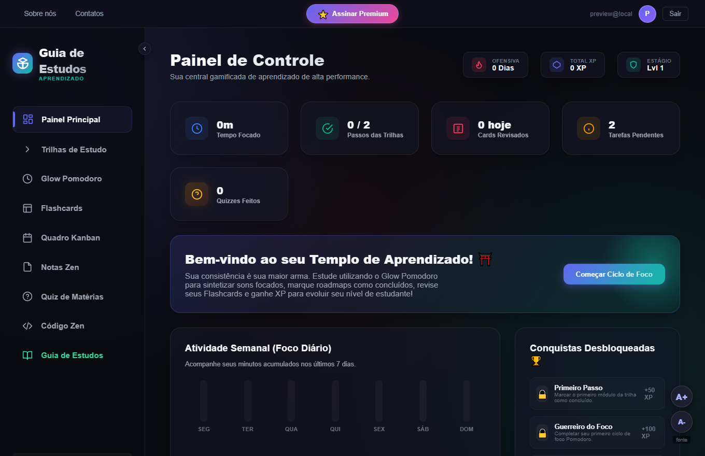
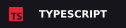
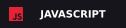

<div align="center">


<br>

<picture>
  <source media="(prefers-color-scheme: dark)" srcset="assets/title-polished-dark.svg" />
  <source media="(prefers-color-scheme: light)" srcset="assets/title-polished-light.svg" />
  
</picture>

<p><code>somewhere between code &amp; noise</code></p>

<br>

`PYTHON / TYPESCRIPT / JAVASCRIPT / HTML`

</div>

> `fragment.log`
>
> In the beginning was the Word, and the Word was with God, and the Word was God. And the Word became flesh and became habituated among us...

<div align="center">

</div>

<br>

<picture>
  <source media="(prefers-color-scheme: dark)" srcset="assets/identity-polished-dark.svg" />
  <source media="(prefers-color-scheme: light)" srcset="assets/identity-polished-light.svg" />
  
</picture>

Sou **Knoten**. Transformo ideias em código: uma IA em desenvolvimento, uma cartinha na web e outros experimentos.

```text
knoten@midnight:~$ cat status.txt

building     Aki
soundtrack   fones no ouvido
status       work in progress_
```

<picture>
  <source media="(prefers-color-scheme: dark)" srcset="assets/experiments-polished-dark.svg" />
  <source media="(prefers-color-scheme: light)" srcset="assets/experiments-polished-light.svg" />
  
</picture>

**[↳ study.log / Guia de estudos](https://github.com/hayaaitfx-ops/Site-guia-de-estudos)**

<a href="https://github.com/hayaaitfx-ops/Site-guia-de-estudos"></a>

Portal de estudos com trilhas, Pomodoro e flashcards; dados salvos no navegador.
`JavaScript · HTML · CSS · localStorage`

**[↳ aki.exe / Aki](https://github.com/hayaaitfx-ops/Aki)**

IA em desenvolvimento com interface de chat e histórico de conversas.
`TypeScript · Next.js · React · Prisma`

[↳ cartinha.html / um experimento em HTML](https://github.com/hayaaitfx-ops/Cartinha)

<picture>
  <source media="(prefers-color-scheme: dark)" srcset="assets/toolkit-polished-dark.svg" />
  <source media="(prefers-color-scheme: light)" srcset="assets/toolkit-polished-light.svg" />
  
</picture>

<div align="center">

<p>




</p>

<br>


<br>

[explore os arquivos ↗](https://github.com/hayaaitfx-ops?tab=repositories)

**────── ⋆ ☾ ⋆ ──────**

<sub><code>session ended. ideas still running_</code></sub>

</div>


