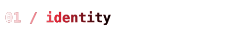
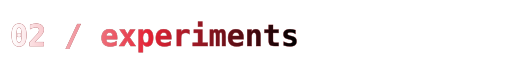
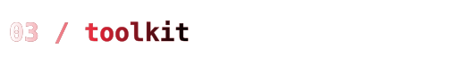
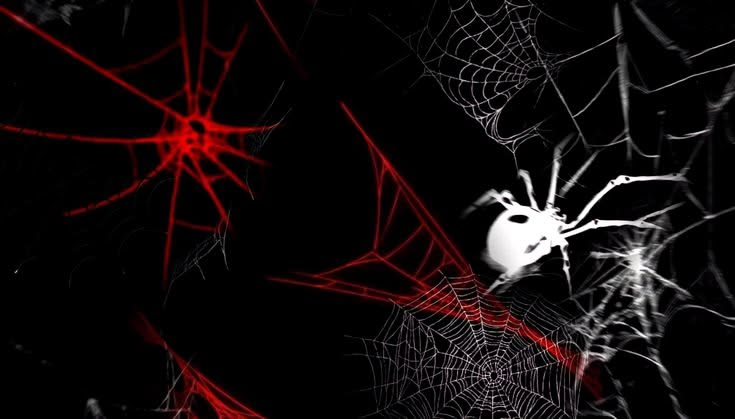

<div align="center">


<br>


<sub>somewhere between code & noise</sub>

<br>

`PYTHON / TYPESCRIPT / JAVASCRIPT / HTML`

<sub>“In the beginning was the Word, and the Word was with God, and the Word was God. And the Word became flesh and became habituated among us...”</sub>

</div>

<br>



Sou **Knoten**. Transformo ideias em código: uma IA em desenvolvimento, uma cartinha na web e outros experimentos.

```text
knoten@midnight:~$ cat status.txt

building     Aki
soundtrack   fones no ouvido
status       work in progress_
```



| Arquivo | Projeto |
| :--- | :--- |
| [↳ aki.exe](https://github.com/hayaaitfx-ops/Aki) | Uma IA em desenvolvimento com TypeScript. |
| [↳ cartinha.html](https://github.com/hayaaitfx-ops/Cartinha) | Uma cartinha feita em HTML. |
| [↳ study.log](https://github.com/hayaaitfx-ops/Site-guia-de-estudos) | Meu projeto de site para um guia de estudos. |



<div align="center">


<br>



<br>

[explore os arquivos ↗](https://github.com/hayaaitfx-ops?tab=repositories)

**────── ⋆ ☾ ⋆ ──────**

<sub><code>session ended. ideas still running_</code></sub>

</div>


